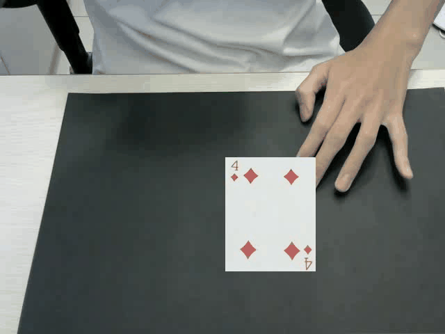

# 61175069H Mitch

## Video
### hw1-1 
</img>
### hw1-2
</img>
### hw1-3
</img>
## Problem
### hw1-1
#### If now is disapear coint flag ,put coint on my hand ,My hand will been background
### hw1-2
#### Very ugly
#### Card Shake 
#### Can not Rotate
### hw1-3
#### Ugliest
#### Can not Rotate
#### Changed only one side

## Solution idea
### hw1-1
#### Twe method  
1. I need to predict which color behind coint(my hand color)
2. Fill Unknown Areas with Nearby Colors (I've tried, but the results are unsatisfactory)
### hw1-2 & hw1-3
#### Ugly
I've spent too much time on HW1-1, but I believe that if I have enough time, I can make HW1-2 and HW1-3 look good.
#### Can not Rotate
After detecting an object, find the difference between the far-left and far-right x-coordinates. Assuming the original x-length of the object is known, I can calculate the extension of the length. This information allows me to determine the rotation angle. Finally, I rotate my image by the calculated angle and overlay it.

Note : This requires precise detection. (So I have failed)
## Some Functions & small tools (write myself)
### get_background.py
#### Save the background image for HW1-1 to capture colors
### poker_matting.py
#### Save the poker image for HW1-2 to paste
### dice_matting.py
#### Save the dice image for HW1-3 to paste
```python
# in:BGR img  out:mask
def get_hand_direction(pic):
# in:mask   out:BGR img
def get_origin_color(img_area):
# in:BGR img   out:BGR img   method = point , center , black , 
def change_color2background(img,center,target,method='center'):
# in:BGR img  out: center ,mask       method = 'color' , 'edge'
def get_coint_direction(origin_pic,method='color'):
#print edge img
def show_edge(origin_pic):
  
```
